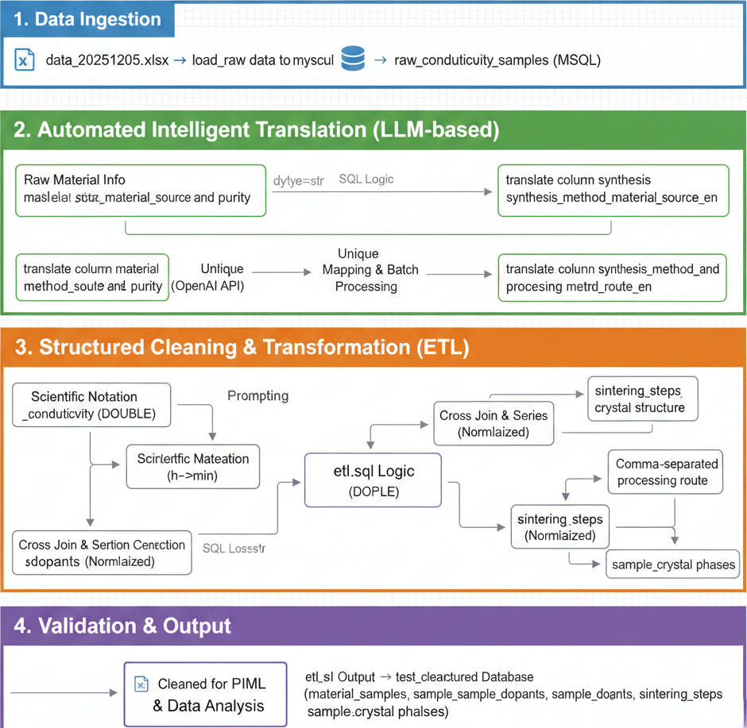

# Experiment Report: Zirconia Conductivity Data Cleaning

## 1. Objective
This experiment aims to perform automated cleaning and standardization of raw research data on the conductivity of zirconia-based materials. The goal is to build a high-quality, structured database by addressing issues in the original data such as messy formatting, unstructured descriptions, and inconsistent units, thereby providing reliable data support for subsequent physics-informed neural network (PIML) model training.

## 2. Environment
* **Language**: Python 3.x
* **Database**: MySQL 8.0+
* **Core libraries**: Pandas, SQLAlchemy, PyMySQL, LangChain (OpenAI API), python-dotenv
* **Data source**: `data_20251205.xlsx` (raw data mined from the literature)

## 3. Data architecture design
To effectively store complex material properties, we designed a relational database schema compliant with the third normal form (3NF):

* **raw_conductivity_samples**: raw-data staging table. All fields are `TEXT` to ensure any nonstandard Excel formatting can be imported losslessly.
* **material_samples**: the cleaned core master table. Stores `sample_id`, references, and standardized physical quantities such as conductivity and operating temperature.
* **sample_dopants**: dopant-detail table. Solves the “multiple values in one cell” problem by splitting mixed dopants such as `Y/Sc/Dy` into multiple rows, including ionic radius, valence, and molar fraction.
* **sintering_steps**: sintering-step table. Stores multi-stage heat-treatment procedures (e.g., "1400℃, 2h -> 1500℃, 4h").
* **sample_crystal_phases**: crystal-phase composition table. Links samples to the `crystal_structure_dict` dictionary table to clarify crystal structures (e.g., cubic, monoclinic).

## 4. Workflow and implementation

### 4.1 Data loading (Ingestion)
Initial loading is performed with the script `load_raw_data_to_mysql.py`.
* **Strategy**: enforce `dtype=str` when reading, avoiding precision loss or formatting errors caused by Pandas’ automatic type inference.
* **Handling**: convert empty cells in Excel to empty strings to ensure completeness when importing into the database.

### 4.2 Automated intelligent translation (LLM-based Translation)
We use a large language model (LLM) to standardize and translate unstructured Chinese descriptions:
* **Raw-material standardization**: run `translate_column_material_source_and_purity.py`, using LangChain to call the OpenAI API and rewrite complex Chinese supplier/purity descriptions (e.g., “商品化材料(Toyo Soda)，>99%”) into standard academic English.
* **Process-description standardization**: run `translate_column_synthesis_method_and_processing_route.py`.
    * **Optimization**: adopt an “extract unique values → batch translate → map back to the database” strategy to significantly reduce token usage.
    * **Concurrency**: use `chain.batch` for concurrent requests to improve throughput.

### 4.3 Structured cleaning and transformation (ETL)
The core cleaning logic is implemented in the SQL script `etl.sql`, mainly including:
1.  **Numeric cleaning**: use the `REGEXP_SUBSTR` regular expression function to extract temperature and time values from mixed text.
2.  **Unit normalization**: implement `CASE WHEN` logic to convert time units (`h`, `min`) into minutes.
3.  **Scientific-notation fixes**: for conductivity fields, replace `×10` and `*10` with the standard `E` notation and convert to double precision (`DOUBLE`).
4.  **Normalization**:
    * Use an SQL `CROSS JOIN` to generate a numeric sequence and, together with `SUBSTRING_INDEX`, split composite dopant strings in a single row (e.g., `Y/Sc/Fe`) into multiple independent records inserted into `sample_dopants`.

### 4.4 Flowchart
The following figure visualizes the full data-cleaning workflow:

## 5. Result verification
We performed spot-check verification of the cleaned results by executing `test_clean_data.sql`:
* **Numeric conversion**: successfully recognizes and converts nonstandard scientific notation such as `1.2×10^-2`.
* **Missing-value cleaning**: placeholders such as `/` in the raw data are correctly converted to `NULL` in the database.
* **Structured validation**: for `sample_id=193`, multi-step sintering data are successfully split into multiple ordered records in the `sintering_steps` table.

## 6. Conclusion
This experiment successfully implemented a hybrid data-cleaning pipeline combining “Python orchestration + LLM semantic enhancement + SQL-based logic processing”. The solution effectively addresses common challenges in materials-science datasets, including abundant unstructured text, strongly coupled multi-component descriptions, and inconsistent formats. The resulting structured database has clear fields and standardized types, fully meeting downstream machine learning modeling needs.

