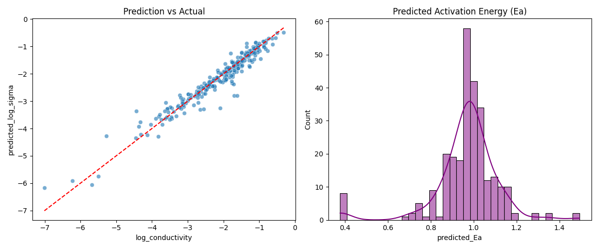

# Experiment Report: Conductivity Prediction with a Physics-Informed Neural Network (PIML)

## 1. Background and Objective
This experiment aims to predict material conductivity (Conductivity) using machine learning, while simultaneously inferring physically meaningful parameters (e.g., activation energy $E_a$). We adopt a **physics-informed neural network (Physics-Informed Neural Network, PIML)** architecture, embedding the Arrhenius law as a constraint layer in the deep learning model to improve generalization and interpretability.

## 2. Setup and Methods

### 2.1 Dataset
* **Data source**: extracted from a local DuckDB database via `MaterialDataProcessor`.
* **Dataset size**: **1351** samples; the ETL output DataFrame shape is **(1351, 14)** (including non-feature columns such as the target `log_conductivity` and the temperature column `temperature_kelvin`).
* **Feature engineering**:
    * **Numerical features**: total dopant fraction, average ionic radius, average valence, number of dopants, maximum sintering temperature, total sintering duration.
    * **Categorical features**: synthesis method, primary dopant element.
    * **Text features**: material source and purity (processed with TF-IDF and SVD for dimensionality reduction).
* **Input dimensionality note**: the network input consists of “6 numerical features + one-hot expansion of 2 categorical features + SVD(16-d) text features”. Therefore, the final dimension depends on the actual one-hot category count (in the script, `X_train.shape[1]`) and is not equal to the 14 columns in the DataFrame.
* **Train/validation split**: 80/20, random seed 42.

### 2.2 Model architecture
We use a custom `PhysicsInformedNet` with two parts:
1.  **Data-driven encoder (Encoder)**: an MLP that extracts latent representations from input features and predicts two physical parameters:
    * **Activation energy ($E_a$)**: constrained to be positive via a Softplus activation.
    * **Pre-exponential factor ($\log A$)**.
2.  **Physics constraint layer (Physics Layer)**: forces the final conductivity prediction $\log(\sigma)$ to follow the Arrhenius equation:
    $$
    \log_{10}(\sigma) = \log_{10}(A) - \log_{10}(T) - \frac{E_a}{k_B \cdot T \cdot \ln(10)}
    $$
    where $k_B$ is the Boltzmann constant and $T$ is the absolute temperature.

### 2.3 Training configuration
* **Optimizer**: AdamW (learning rate = 1e-3, weight decay = 1e-4).
* **Loss**: mean squared error (MSELoss).
* **Training epochs**: 300.
* **Batch size**: 32.

## 3. Training process analysis
Based on the training log (`1.log`):
* **Convergence**: training converges quickly. The initial validation loss is **3.0193**, dropping to **0.4678** by epoch 10.
* **Stable phase**: after ~epoch 60, the validation loss fluctuates and roughly converges in the **0.06–0.13** range, with an overall stable trend.
* **Best model**: around epoch 250 the model reaches a near-optimal value (loss $\approx$ 0.0659) and then fluctuates between 0.065 and 0.085; no obvious rebound is observed in the validation loss (the script does not record the training curve, so strict overfitting diagnosis is not possible).

## 4. Results

### 4.1 Quantitative evaluation
* **Final metrics**: on the validation set, RMSE is **0.2532** and **$R^2 \approx 0.9353$**. Since the target is $\log_{10}$-scaled conductivity, RMSE = 0.2532 corresponds to a typical multiplicative error of $10^{0.2532}\approx 1.79$ (i.e., in most cases within roughly a **2×** factor), indicating high accuracy.

### 4.2 Visualization
The generated plots are shown below:

1.  **Prediction vs. actual**:
    * **Left panel**: the scatter points lie tightly around the red dashed line ($y=x$).
    * **Linear relationship**: the model shows strong linear correlation over the plotted range ($R^2 \approx 0.9353$).
    * **Error distribution**: a few outliers exist in the low-conductivity region (-6 to -7), while the high-density region (-1 to -4) is fitted extremely well.

2.  **Predicted activation energy distribution ($E_a$)**:
    * **Right panel**: the inferred activation energy $E_a$ is unimodally distributed, concentrated around **~1 eV** (per the plot).
    * **Reasonableness**: this magnitude is consistent with reported activation energies for common oxide solid electrolytes (e.g., zirconia-based systems), indicating that the PIML model outputs physically meaningful intermediate parameters while fitting conductivity.

## 5. Conclusion
1.  **Model effectiveness**: with a small dataset (1351 records), the PIML model achieves low prediction error (RMSE 0.2532), validating the benefit of physics constraints.
2.  **Physical interpretability**: the model successfully disentangles the temperature effect on conductivity and produces a reasonable activation-energy distribution ($E_a$), making it more than a “black box” and enabling physical analysis.
3.  **Future improvements**: while the overall fit is good, there is room for improvement in the extremely low-conductivity region; future work may oversample low-conductivity samples or reweight the loss function.

