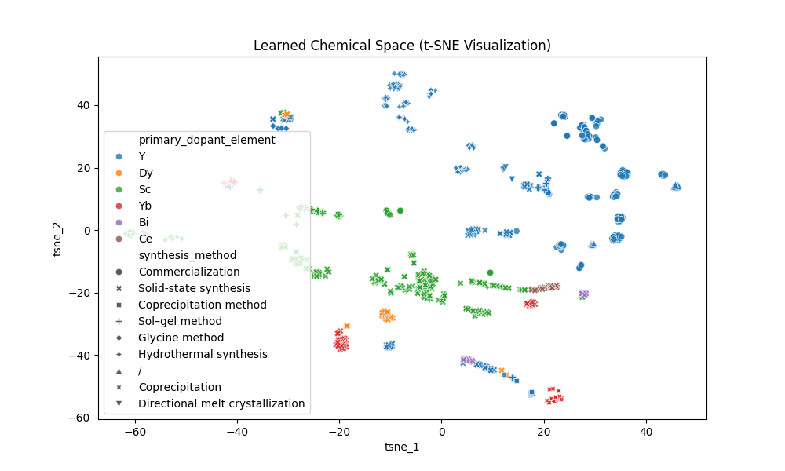
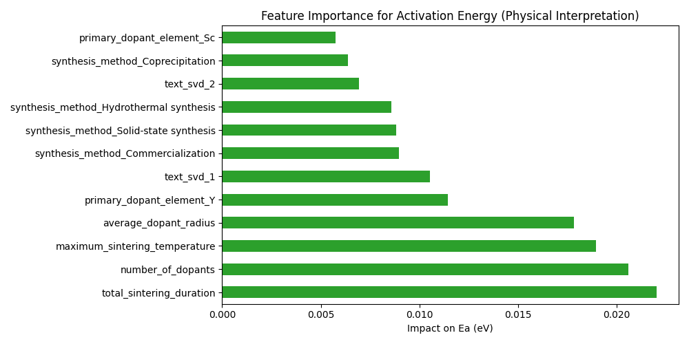
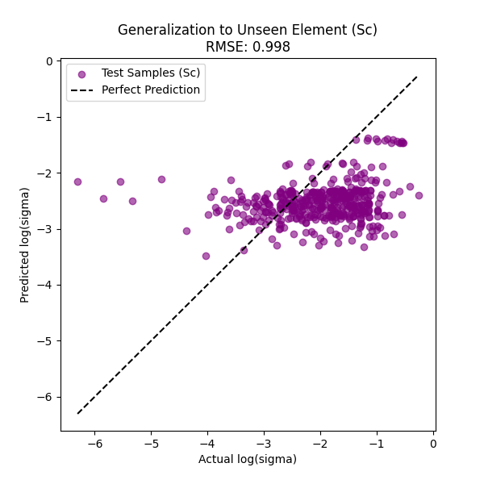

# Experiment Report: Mechanistic Analysis of Zirconia Conductivity via a Physics-Informed Neural Network

## 1. Background and Objective
This study applies physics-informed machine learning (PIML) to perform an in-depth analysis of conductivity data for zirconia-based materials. Unlike traditional black-box models, we embed the Arrhenius law into the neural-network architecture to not only predict material performance, but also to:
1.  **Visualize the latent space**: investigate whether the model can automatically learn chemical distribution patterns.
2.  **Provide physical attribution**: explain the key physical and processing factors that affect the activation energy ($E_a$).
3.  **Discover unseen materials**: evaluate the model’s generalization capability to dopants not present in the training set (e.g., Sc).

## 2. Methods

### 2.1 Data processing and feature engineering
* **Data source**: experimental data are stored in DuckDB; SQL aggregation is used to combine dopant physical properties (e.g., weighted-average radius, average valence) and sintering-process parameters.
* **Feature preprocessing**: a hybrid pipeline is built including numerical standardization, categorical one-hot encoding, and TF-IDF/SVD dimensionality reduction for text features.

### 2.2 Model architecture
We use a custom `PhysicsInformedNet`, which includes:
* **Encoder**: maps high-dimensional material features into a low-dimensional latent space.
* **Physical-parameter heads**: separately predict activation energy $E_a$ and the prefactor $\log A$.
* **Physics constraint layer**: enforces the Arrhenius equation $\log(\sigma) = \log(A) - \log(T) - \frac{E_a}{k_B T \ln(10)}$ for the final conductivity prediction, ensuring thermodynamic consistency.

---

## 3. Results and Analysis

### 3.1 Experiment 1: Latent space visualization of material chemistry (Latent Space Visualization)

* **Approach**: use t-SNE to reduce the high-dimensional features extracted by the Encoder to a 2D plane.
* **Figure**:

* **Discussion**:
    * **Chemical clustering trend**: overall, points show a grouping tendency by the “primary dopant element”. For example, Yb (red points) and Dy (orange points) form relatively compact clusters, while Y (blue points)—with the largest sample size—spreads more broadly and overlaps/interleaves with elements such as Sc (green points).
    * **Representation learning**: although cluster boundaries are not perfectly sharp, the model captures chemical-similarity trends from raw features without any explicit chemistry rules; different dopants exhibit recognizable distribution differences in latent space.
    * **Process distribution**: within the same dopant, different point shapes (different synthesis methods, e.g., solid-state synthesis, coprecipitation) are mixed but still show some sub-structure, suggesting process factors have a secondary influence on properties.

### 3.2 Experiment 2: Physical attribution for activation energy (Feature Importance for $E_a$)

* **Approach**: perform permutation importance analysis on the network branch predicting activation energy $E_a$.
* **Figure**:

* **Discussion**:
    * **Primary drivers**: `total_sintering_duration` has the largest impact on activation energy, followed by `number_of_dopants` and `maximum_sintering_temperature`. This indicates that sintering parameters (grain growth and densification) are critical for reducing grain-boundary resistance and changing the overall activation energy.
    * **Physical factor**: `average_dopant_radius` ranks fourth and remains an important physical feature. This matches physical intuition, as dopant-radius-induced lattice distortion is a key factor controlling the oxygen-ion migration barrier.
    * **Secondary factors**: `primary_dopant_element_Y` and one-hot variables for synthesis methods (`Commercialization`, `Solid-state synthesis`, `Hydrothermal synthesis`, `Coprecipitation`) also show non-trivial importance, reflecting the combined effects of dopant identity and synthesis route on activation energy.

#### 3.2.1 Semantic interpretation of text features `text_svd`

In the feature-importance ranking above, `text_svd_1` (rank 6) and `text_svd_2` (rank 10) are latent semantic components obtained by applying TF-IDF vectorization to the text field `material_source_and_purity` and then reducing it via TruncatedSVD (16 dimensions). To interpret their physical meaning, we used the `inspect_text_svd.py` script to reverse-analyze the high-weight words of each SVD component (full results in `results/text_svd_interpretation.txt`). Key findings:

| Component | High-weight terms (positive) | High-weight terms (negative) | Semantic interpretation |
|------|-------------|-------------|---------|
| `text_svd_1` | 99, supplied, no3, aladdin, shanghai, adamas | 200, nm, oxide, materials, zirconia, sc2o3 | **Reagent sourcing & purity**: positive direction aligns with “high-purity chemical reagents + specific commercial suppliers (e.g., Shanghai Aladdin/Adamas)”, while negative direction aligns with “descriptions of nano-oxide powder feedstocks”. |
| `text_svd_2` | y2o3, sc2o3, zro2, materials, starting | oxide, zirconia, 200, nm, scandium, ytterbium | **Feedstock chemical composition**: positive direction aligns with “starting materials specified by explicit chemical formulas (Y₂O₃, Sc₂O₃, ZrO₂)”, while negative direction aligns with “starting materials described using generic names (oxide, zirconia, scandium)”. |

* **Physical meaning**:
    * `text_svd_1` suggests an effect of **feedstock quality and sourcing** on activation energy—samples using high-purity, reagent-grade precursors (e.g., nitrate precursors) differ measurably in activation energy from samples using commercial nano-oxide powders. This implies that purity and morphology (solution precursors vs. powders) may indirectly change activation energy by affecting sintering microstructure (e.g., impurity concentration at grain boundaries, pore distribution).
    * `text_svd_2` captures differences in **naming conventions of starting materials**—papers using precise chemical formulas often correlate with particular experimental traditions and preparation rigor, and this semantic signal aligns with systematic differences in activation energy.

#### 3.2.2 Overview of semantic themes across all text SVD components

To further understand the role of text features, we used `inspect_text_svd.py` to analyze all **16 latent semantic components** (`text_svd_0` ~ `text_svd_15`) produced by TruncatedSVD (full output in `results/text_svd_interpretation.txt`). Below, we group these components into four theme clusters based on their dominant semantic dimensions.

**Theme Cluster A: Purity and reagent sourcing**

| Component | High-weight terms (positive) | High-weight terms (negative) | Semantic interpretation |
|------|-------------|-------------|----------|
| `text_svd_0` | 99, used, materials, 200, nm, y2o3, oxide, supplied | — | **Baseline theme**: captures the most common words in the corpus (purity marker “99”, common feedstock keywords), essentially the mean background of the text descriptions. |
| `text_svd_1` | 99, supplied, no3, aladdin, shanghai, adamas | 200, nm, oxide, materials, zirconia, sc2o3 | **Reagent vs. powder**: positive direction aligns with high-purity chemical reagents + commercial suppliers (Aladdin/Adamas), while negative direction aligns with nano-oxide powder feedstocks. |
| `text_svd_9` | purity, china, yb2o3, geoquin, rare, earth, nano, farmeiya | commercial, japan, tokyo, tosoh, 8ysz, sc2o3 | **Domestic high-purity feedstocks vs. Japanese commercial powders**: distinguishes Chinese suppliers (purity-oriented) from established commercial products such as Japan’s Tosoh. |

**Theme Cluster B: Compound naming system and feedstock specifications**

| Component | High-weight terms (positive) | High-weight terms (negative) | Semantic interpretation |
|------|-------------|-------------|----------|
| `text_svd_2` | y2o3, sc2o3, zro2, materials, starting, zrocl2 | oxide, zirconia, 200, nm, scandium, ytterbium | **Chemical formula vs. generic name**: contrasts explicit formula labels (Y₂O₃, Sc₂O₃) with generic names (oxide, scandium). |
| `text_svd_6` | scandia, powders, ceria, 200, nm, yttria | size, particle, powder, oxide, 6h2o, no3 | **Generic oxide names + nanopowders**: associated with nanometer-scale powder products labeled with generic names such as “scandia/ceria/yttria”. |
| `text_svd_8` | 6h2o, no3, sc2o3, zr, zro2, ce | zrocl2, starting, gd2o3, particle, size, powder | **Hydrated nitrates vs. chloride precursors**: distinguishes two wet-chemical routes (nitrate sol–gel vs. zirconyl chloride coprecipitation). |

**Theme Cluster C: Powder morphology, processing routes, and preparation descriptions**

| Component | High-weight terms (positive) | High-weight terms (negative) | Semantic interpretation |
|------|-------------|-------------|----------|
| `text_svd_3` | 110, tpo, tmpta, hdda, eda, byk, zirconia | powder, oxide, particle, size, scandium, purity | **Photocuring/additive-manufacturing additives**: associated with organic additive systems for 3D-printed ceramics, such as the photoinitiator (TPO) and crosslinkers (TMPTA, HDDA). |
| `text_svd_4` | powder, particle, size, purity, supplied, commercial | oxide, scandium, materials, starting, zrocl2, ytterbium | **Commercial powder quality descriptors**: captures commercial powder parameters described mainly by particle size and purity. |
| `text_svd_5` | oxide, purity, supplied, commercial, material, scandium, japan, china | particle, size, no3, 200, nm, 6h2o, scandia, yttria | **Purchased commercial oxides vs. in-house nanopowder/solution routes**: distinguishes a simple route of purchasing high-purity oxides from more detailed routes that describe particle size/precursors. |
| `text_svd_11` | raw, ceria, scandia, zrocl2, materials, size, particle, yb2o3 | starting, powders, nm, 200, bi2o3, bismuth, zro2 | **“Raw materials” narrative**: associated with papers that describe starting materials using the phrase “raw materials”. |
| `text_svd_12` | material, scsz, prepared, method, mixture, y2o3, house, mixed | supplied, materials, usa, sc2o3, commercial, raw, alfa, aesar | **In-house prepared vs. commercially supplied**: positive direction aligns with “in-house prepared”, negative direction aligns with commercial sources such as “supplied by Alfa Aesar”. |
| `text_svd_13` | raw, yttria, materials, scsz, nm, 200, method, prepared | mixture, ceria, scandia, zirconia, starting, ytterbium | **In-house nanopowder descriptions**: associated with description styles for in-house nano-scale feedstocks. |
| `text_svd_15` | material, purity, scsz, obtained, raw, mixture, high, sputtering | prepared, method, house, mixed, fe2o3, coprecipitation, supplied, china | **Thin-film sputtering vs. wet-chemical coprecipitation**: distinguishes dry processes such as sputtering from wet-chemical routes such as coprecipitation. |

**Theme Cluster D: Geography and supplier signals**

| Component | High-weight terms (positive) | High-weight terms (negative) | Semantic interpretation |
|------|-------------|-------------|----------|
| `text_svd_7` | starting, commercial, 6h2o, zrocl2, no3, japan, tokyo | sc2o3, zro2, 99, shanghai, aladdin, adamas | **Japan vs. China suppliers**: positive direction aligns with Tokyo/Japan commercial sources + wet-chemical precursors; negative direction aligns with Shanghai/China reagent suppliers. |
| `text_svd_10` | ceria, powder, scandia, purity, 99, alfa, aesar | powders, china, yb2o3, material, size, particle, japan, 8ysz | **Western suppliers vs. Asian suppliers**: contrasts brands such as Alfa Aesar (Thermo Fisher) with Chinese/Japanese sources. |
| `text_svd_14` | y2o3, mixture, raw, supplied, kyoritsu, ceramic, bi2o3, ytterbium | purity, sc2o3, obtained, scsz, tokyo, starting, japan, ysz | **Japan Kyoritsu ceramic feedstocks**: associated with a specific Japanese ceramic supplier and multi-dopant systems containing Bi₂O₃/Yb₂O₃. |

* **Overall discussion**:
    * **Four semantic dimensions**: the 16 SVD components can be summarized into four latent semantic categories—(A) feedstock purity and reagent grade, (B) compound naming conventions and specification style, (C) powder morphology and processing route, and (D) geography/supplier signals. Together, these dimensions provide a holistic decomposition of the `material_source_and_purity` text field.
    * **Physical signal in feature importance**: the high-ranking `text_svd_1` (rank 6) and `text_svd_2` (rank 10) correspond to the most prominent contrast axes in theme clusters A and B, indicating that **reagent grade** and **formula-labeling conventions** are the most activation-energy-relevant latent variables carried by the text. This aligns with a physical mechanism where purity affects grain-boundary impurity concentration and thus changes the ion-migration barrier.
    * **Implicit encoding of synthesis routes**: components such as `text_svd_3` (photocuring additives), `text_svd_8` (nitrates vs. chlorides), and `text_svd_15` (sputtering vs. coprecipitation) suggest that text features also indirectly encode **route differences**, which affect conductivity by shaping the final microstructure (grain size, porosity, grain-boundary phases).
    * **Statistical meaning of geographic signals**: the geography/supplier dimensions in cluster D may reflect systematic experimental differences across research groups (e.g., instrumentation calibration, measurement conditions), and may also capture hidden differences in actual purity and particle characteristics across commercial batches.

### 3.3 Experiment 3: Zero-shot discovery ability test (Zero-Shot Discovery)

* **Approach**: use a Leave-One-Dopant-Out (LODO) setting—remove all samples containing Sc from the training set, train the model on the remaining elements, and then predict performance for Sc-doped materials.
* **Figure**:

* **Discussion**:
    * **Limited prediction accuracy**: with Sc completely unseen during training, the test RMSE is **0.9976**, much larger than the normal-training RMSE ≈ 0.253 (~4×), indicating clear limitations in true zero-shot generalization.
    * **Systematic bias**: the scatter plot shows a **systematic underestimation** for high-conductivity samples (Actual log(σ) > -2). Predictions are compressed into a narrow band (-1.5 to -3), failing to differentiate high-conductivity levels. This likely arises because other dopants in the training set generally exhibit lower conductivity than Sc, leading to a conservative prior.
    * **Positive signal**: despite limited accuracy, predictions are not random. In the low-conductivity region (Actual log(σ) < -3), predictions roughly follow the trend, and the overall distribution remains within a physically reasonable range rather than diverging. This suggests the Arrhenius physics layer provides some cross-element transfer, keeping predictions physically plausible even for unseen elements.
    * **Limitation analysis**: Sc is known as one of the best dopants for zirconia conductivity; its Sc³⁺ ionic radius (0.87 Å) matches Zr⁴⁺ (0.84 Å) extremely well, a property hard to replicate with other dopants. In addition, Sc samples account for ~33% of the dataset (442/1351); removing them substantially shrinks the training set, further increasing the difficulty of generalization.

---

## 4. Conclusion
This study validates the effectiveness of PIML for materials-science data analysis:
1.  The model can **spontaneously learn** chemically meaningful categorization structure.
2.  The model can **correctly identify** key processing parameters (sintering time, sintering temperature) and physical parameters (ionic radius) controlling ionic conductivity, providing strong interpretability.
3.  In the zero-shot cross-element test, the model shows **initial transfer capability** (LODO-Sc RMSE = 0.998): the physics constraint layer yields a reasonable trend, but accuracy remains significantly worse than normal training (RMSE ≈ 0.253), indicating substantial room for improvement when a special element is entirely missing from training.

