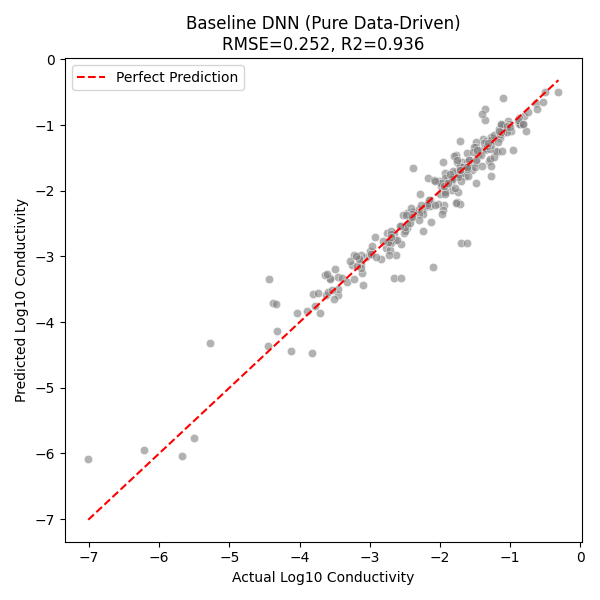
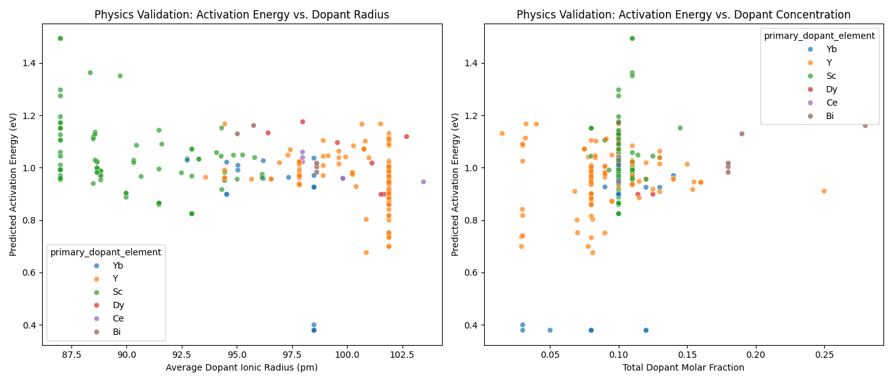

# Experiment Report: Conductivity Prediction Comparison Between PIML and Baseline Models

## 1. Overview
**Experiment Name**: Experiment 3 - Baseline model training and multi-model evaluation  
**Experiment Date**: 2026/02/11  
**Objectives**:
1. Build and train a purely data-driven deep neural network (Standard DNN) as a strong baseline.
2. Compare the proposed physics-informed neural network (PIML) with the baseline model and traditional ML models (Random Forest, XGBoost) on zirconia conductivity prediction.
3. Validate the potential of the models for virtual screening of new materials.

## 2. Setup and Methods

### 2.1 Data flow and feature engineering
* **Data source**: extracted from DuckDB via `MaterialDataProcessor`, including dopant properties (radius, valence, molar fraction), sintering-process parameters, and text descriptions.
* **Preprocessing**:
    * **Numerical features**: standardized using `StandardScaler`.
    * **Categorical features**: encoded with `OneHotEncoder`.
    * **Text features**: TF-IDF + SVD dimensionality reduction on the `material_source_and_purity` field.
* **Train/test split**: 80/20, random seed 42.

### 2.2 Model architecture comparison
* **Baseline DNN (Standard DNN)**:
    * **Architecture**: a 3-layer MLP encoder (128-64-32) with a regression head.
    * **Input handling**: temperature is Z-score standardized and fed directly as a feature; no physics-formula constraints are imposed, representing a pure data-driven “black-box” approach.
* **Compared models**: Random Forest, XGBoost, and PIML (the physics-informed neural network used in this project).

## 3. Results

### 3.1 Quantitative performance comparison
The test-set results are summarized below:

| Model | RMSE | R² Score | Notes |
| :--- | :--- | :--- | :--- |
| **PIML (Ours)** | **0.2532** | **0.9353** | **Excellent**, comparable to DNN while providing physical interpretability. |
| **Standard DNN** | 0.2518 | 0.9360 | Slightly better; deep learning clearly outperforms traditional ML on this dataset. |
| Random Forest | 0.7222 | 0.4740 | Poor; fails to capture complex nonlinearity between materials/process and conductivity. |
| XGBoost | 0.7179 | 0.4803 | Moderate but far worse than deep learning models. |

> Data source: `final_metrics_comparison.csv`

**Key takeaways**:
1. **Deep learning advantage is significant**: both PIML and Standard DNN achieve $R^2 > 0.93$, while the traditional ensemble models are only at 0.47–0.48. This indicates deep neural networks better extract the complex mapping between composition and conductivity.
2. **Effectiveness of PIML**: even with physics constraints (Arrhenius structure), PIML maintains accuracy very close to the pure DNN baseline (RMSE higher by only ~0.0014). This shows physics guidance does not significantly sacrifice fitting ability and adds generalization and interpretability.

### 3.2 Baseline DNN performance
After 300 epochs of training, the baseline DNN converges with a best validation loss of ~0.067.

**Prediction vs. actual scatter plot**:

*Figure 1: Baseline DNN predictions on the test set. The point cloud lies tightly around the red diagonal (perfect prediction), indicating no obvious bias.*

### 3.3 Physical consistency analysis (PIML-specific)
While the Standard DNN achieves high accuracy, it cannot explain the physical mechanism behind predictions. The PIML model outputs intermediate physical parameters—activation energy ($E_a$).

**Relationship between activation energy and material structure**:

*Figure 2: (Left) Predicted activation energy vs. average dopant ionic radius; (Right) Predicted activation energy vs. total dopant concentration. This figure checks whether the learned physical patterns align with electrochemical intuition.*

## 4. Application validation: Virtual screening (Virtual Screening)
Using the trained PIML model, we virtually screened materials with different dopants (Sc, Y, Yb, Gd) and concentrations (0.06–0.16). At 800°C, the top candidates are consistently **Sc-doped** systems.

**Top 5 recommended materials**:

| Rank | Sample ID | Dopant | Dopant fraction | Predicted $E_a$ (eV) | Predicted $\sigma$ (S/cm) |
| :--- | :--- | :--- | :--- | :--- | :--- |
| 1 | Virtual_Sc_0.16 | Sc | 0.16 | 0.9926 | 0.0598 |
| 2 | Virtual_Sc_0.14 | Sc | 0.14 | 0.9924 | 0.0596 |
| 3 | Virtual_Sc_0.12 | Sc | 0.12 | 0.9923 | 0.0594 |
| 4 | Virtual_Sc_0.10 | Sc | 0.10 | 0.9921 | 0.0592 |
| 5 | Virtual_Sc_0.08 | Sc | 0.08 | 0.9920 | 0.0590 |

> Data source: `virtual_screening_results.csv`

**Screening findings**:
* The model consistently predicts **Sc** doping yields the highest conductivity under the current processing conditions (~0.06 S/cm).
* The predicted activation energy ($E_a$) is ~0.99 eV and remains stable across the concentration range.

## 5. Conclusion
This experiment establishes a high-performance deep-learning baseline model and shows that, on this dataset, **deep learning significantly outperforms traditional machine learning** (substantially lower RMSE). In addition, the **PIML model** achieves high accuracy (RMSE: 0.2532) while providing physical interpretability, and successfully recommends Sc-doped candidate materials through virtual screening, meeting the experiment objectives.

