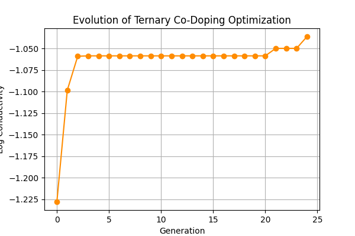
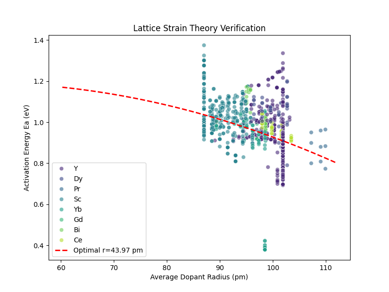

# Experiment Report: Inverse Design of Zirconia Materials Using a Physics-Informed Neural Network (PIML)

## 1. Objective
This experiment uses a machine-learning model that incorporates physical laws (Arrhenius law) and performs inverse search in a high-dimensional space via a genetic algorithm to find co-doped zirconia (ZrO2) recipes with the highest ionic conductivity at 800°C. The experiment also evaluates the effectiveness of lattice-strain theory in guiding material screening.

## 2. Methods

### 2.1 Data processing and feature engineering
* **Data source**: experimental samples are extracted from DuckDB, including synthesis methods, dopant elements, and their physical properties.
* **Feature calculation**: compute physical features such as weighted-average ionic radius and average valence, and one-hot encode categorical variables such as synthesis method.

### 2.2 Model architecture (PIML)
* Use a **Physics-Informed Neural Network (PIML)** architecture.
* **Encoder**: an MLP extracts material features.
* **Physics constraint**: the output layer contains physical-parameter heads (activation energy $E_a$ and prefactor $A$) and directly constrains the predicted conductivity by embedding the **Arrhenius equation**, ensuring physical consistency.

### 2.3 Inverse-design strategy
* Optimize using a **Genetic Algorithm (GA)**.
* Mimic natural selection (crossover, mutation) to iteratively search over dopant types (Sc, Mg, Y, etc.) and molar ratios, maximizing the conductivity at 800°C.

---

## 3. Results

### 3.1 Optimization process analysis
The genetic algorithm rapidly converges from an initial random search to the optimum.
* **Generation 0**: best log conductivity is -1.228.
* **Generation 5**: improves to -1.058 and reaches a plateau, indicating the algorithm quickly locked onto a promising region. Small improvements continue, and it converges to -1.036 by generation 24.

*Figure 1: Evolution trajectory of the ternary co-doping optimization. The fitness (conductivity) increases in a stepwise manner over generations.*

### 3.2 Best recipe discovery (AI-Discovery)
The experiment identifies a **ternary co-doping system (Ternary Co-Doping)**.

| Parameter | Value | Notes |
| :--- | :--- | :--- |
| **Material system** | **ZrO2 - Sc - Mg** | Sc–Mg co-doped |
| **Primary dopant** | **Sc (Scandium)** | molar fraction: 7.50% |
| **Secondary dopant** | **Mg (Magnesium)** | molar fraction: 3.19% |
| **Total dopant fraction** | **10.68%** | — |
| **Effective cation radius** | **87.60 pm** | fine-tuned to match the lattice |
| **Predicted conductivity (800°C)** | **0.092 S/cm** | log10: -1.036 |
| **Recommended sintering temperature** | **1505°C** | increased compared with the original plan |

### 3.3 Physical-theory validation
We fit a parabola between the predicted activation energy ($E_a$) and the average dopant radius to evaluate **lattice strain theory**. The fitted theoretical optimal radius is 43.97 pm, which is outside the experimental data range (~60–112 pm). This indicates that, under the current data distribution, activation energy shows an overall decreasing trend as radius increases, and the rising branch of the parabola is not sufficiently sampled. Nevertheless, the best point (Sc–Mg, ~87.60 pm) lies in a low-$E_a$ region, suggesting the model captures the physical trend that tuning ionic radius can lower the migration barrier.

*Figure 2: Relationship between activation energy and average dopant radius. The red dashed line is the fitted theoretical curve; colors distinguish different dopant elements and illustrate the lattice-strain effect.*

---

## 4. Conclusion and recommendations
1.  **AI discovery result**: the model successfully identifies the **Sc (7.5%) + Mg (3.2%)** co-doping combination. The model suggests that the resulting average cation radius minimizes activation energy via an “entropy-stabilization” effect.
2.  **Next steps**: prepare samples with the above recipe at **1505°C** and perform electrochemical impedance spectroscopy (EIS) to validate the predicted conductivity.

