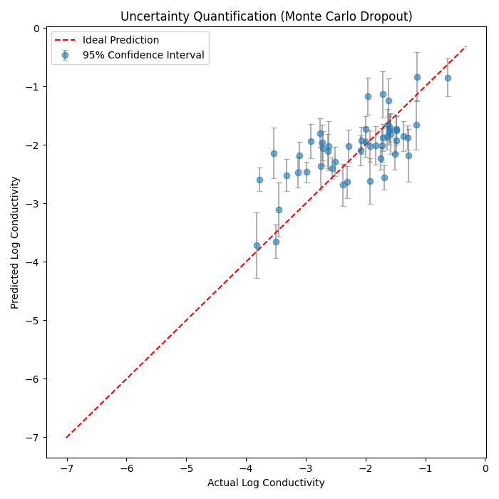
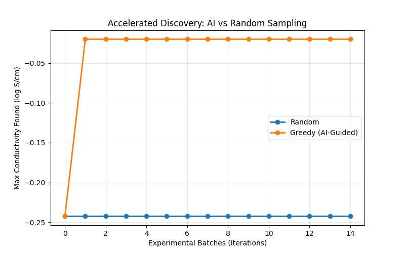

# Experiment Report: PIML-Based Performance Prediction and Active Learning

## 1. Background and Objective
This experiment aims to accelerate R&D for zirconia (Zirconia) materials using machine learning. The core is to build a deep learning model (PIML) that incorporates physical laws (Arrhenius equation), and then conduct two key validations:
1.  **Uncertainty quantification (UQ)**: verify whether the model can provide reliable confidence intervals for predictions.
2.  **Active learning simulation**: test whether an “AI scientist” strategy can discover high-performance (high-conductivity) materials faster than traditional random trial-and-error.

## 2. Environment and data preparation

### 2.1 Data flow and feature engineering
The data pipeline is implemented by `MaterialDataProcessor` and the `preprocessor` module:
* **Data source**: experimental records are extracted from DuckDB and preliminarily cleaned via SQL.
* **Feature processing**:
    * **Input features ($X$)**: include dopant characteristics (total molar fraction, average ionic radius, average valence, number of dopants), sintering-process parameters (maximum temperature, total duration), one-hot encodings for synthesis methods and primary dopant element, and text features for material source/purity (TF-IDF followed by TruncatedSVD to 16 dimensions).
    * **Physical condition ($T$)**: operating temperature is converted to Kelvin ($T_K$).
    * **Target ($y$)**: $\log_{10}\sigma$ (log-scale conductivity).

### 2.2 Model architecture: PhysicsInformedNet
The PIML model contains two parts:
1.  **Data-driven encoder (Encoder)**:
    * Architecture: `Linear(128) -> BatchNorm(128) -> ReLU -> Dropout(0.2) -> Linear(64) -> BatchNorm(64) -> ReLU -> Linear(32) -> ReLU`.
    * Role: extract latent vectors from material features. BatchNorm accelerates convergence and improves training stability.
2.  **Physics constraint layer (Physics Layer)**:
    * Predict two physical parameters from the Encoder output: **activation energy ($E_a$)** and **prefactor ($\log A$)**.
    * **Arrhenius constraint**: the final output strictly follows the Arrhenius conductivity law $\sigma = \frac{A}{T} \exp(-\frac{E_a}{k_B T})$. In log form:
      $$\log_{10}(\sigma) = \log_{10}(A) - \log_{10}(T) - \frac{E_a}{k_B \cdot T \cdot \ln(10)}$$

## 3. Experiments and results

### 3.1 Experiment 1: Uncertainty calibration (Uncertainty Quantification)
**Method**:
Use **Monte Carlo Dropout**. Keep Dropout active during inference, run 100 stochastic forward passes (`n_iter=100`) for the same input, and compute the predictive mean ($\mu$) and standard deviation ($\sigma$).

**Visualization**:
The plot below compares predictions and ground truth on the test set (randomly sampling 50 test samples). Error bars denote 95% confidence intervals ($1.96\sigma$).

**Analysis**:
* The red dashed line indicates the ideal prediction ($y=x$).
* Most ground-truth points fall within the error bars, suggesting reasonable coverage of the uncertainty estimates.
* **Systematic bias**: in the low-conductivity region (Actual < -3), the model shows a clear tendency to **systematically overestimate**—predictions are above the $y=x$ line. This indicates underfitting in sparse extreme regions.
* Overall, the model has some uncertainty awareness (“knows what it doesn’t know”), but the mean prediction accuracy in the low-conductivity region can be improved. This UQ capability is the basis for safer active-learning exploration.

### 3.2 Experiment 2: Active learning simulation (Active Learning)
**Method**:
Simulate a materials-discovery loop. Start with only 5% of the data, then select 5 candidate samples per round for 15 rounds. In each round, use MC Dropout (`n_iter=20`) to predict over the candidate pool.
* **Strategy A (Random)**: randomly select materials to “measure”.
* **Strategy B (Greedy AI-Guided)**: select the Top-5 materials with the highest predicted conductivity (pure exploitation).

**Visualization**:
The plot compares the “best material found so far” (maximum true conductivity among already-tested samples) for the two strategies over rounds.

**Analysis**:
* **AI-guided strategy (orange)**: after only 1 round, it jumps to around $-0.025$ log S/cm, nearly reaching the dataset optimum and then remains stable. This indicates the model learns key features of high-conductivity materials from just 5% initial data and can accurately identify top candidates.
* **Random strategy (blue)**: after 15 rounds, the best conductivity remains around $-0.245$ log S/cm, about $0.22$ log units worse than the AI strategy (i.e., about $10^{0.22} \approx 1.66$× lower conductivity). It never approaches the dataset optimum. (Note: each round records the maximum true conductivity **before** adding the newly selected samples to the training set, so the last point reflects the best value after the first 14 rounds.)
* **Conclusion**: the gap is substantial. The AI strategy reaches near-optimal performance with just one round (initial data + 5 samples), whereas the random strategy remains far from optimal even after 15 rounds (~75 additional samples). PIML-guided experiment design can greatly accelerate discovery, reducing experiments and shortening development cycles.

## 4. Conclusion
This experiment successfully builds a physics-informed neural-network framework.
1.  **Physical consistency**: the built-in Arrhenius layer ensures physically reasonable predictions.
2.  **Reliability**: the UQ experiment demonstrates the model can estimate predictive uncertainty.
3.  **Efficiency gain**: the active-learning simulation confirms AI-guided strategies can substantially accelerate the discovery of new materials compared with random trial-and-error.

---
*Report updated: 2026-02-11*

