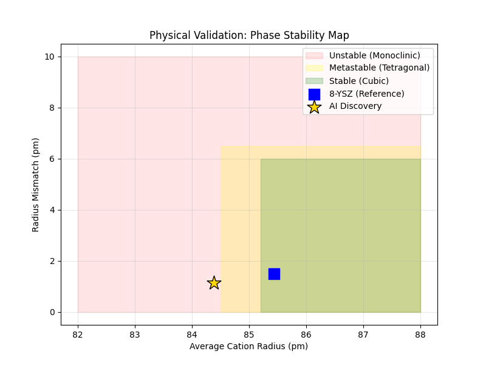

# 实验报告：AI 发现新型氧化锆材料的热力学稳定性验证

## 1. 实验目的
本实验旨在验证由 AI 模型推荐的新型共掺杂氧化锆材料（Recipe）的热力学稳定性。通过基于离子半径的经验公式（Empirical Rules），计算阳离子平均半径、半径失配度（Radius Mismatch）及容忍因子，预测材料的相结构稳定性，并生成用于后续 DFT（第一性原理）计算的晶体结构文件。

## 2. 实验对象与输入
* **实验脚本**：`06_verify_stability.py`
* **输入数据源**：AI 模型推荐的最佳配方（`ai_discovery_best_recipe.csv`）
* **基准参考**：8 mol% YSZ（氧化钇稳定氧化锆），作为工业标准参考点（理论半径 ~85.43 pm）。

## 3. 实验原理与方法
实验采用基于 **Shannon 离子半径** 的物理模型进行评估，主要关注以下三个核心指标：

1.  **平均阳离子半径 ($r_{avg}$)**：反映晶格整体膨胀或收缩趋势。
2.  **半径失配度 (Radius Mismatch, $\delta$)**：计算阳离子半径的方差，用于衡量晶格畸变程度。
    * 公式：$\sqrt{\sum c_i (r_i - r_{avg})^2}$
3.  **阳离子/阴离子比率 (Cation/Anion Ratio)**：类比 Goldschmidt 容忍因子，用于判断晶体相结构（立方相 vs 四方相 vs 单斜相）。

**判定标准**：

| 区域 | 颜色标识 | 判定条件 | 物理意义 |
| :--- | :--- | :--- | :--- |
| **稳定** | 🟩 绿色 | 比率 $\ge 0.615$ 且 失配度 $< 6.5$ | 理想立方相 (Cubic Phase) |
| **亚稳态** | 🟨 黄色 | 比率 $\ge 0.605$ | 四方/立方混合相 (高导电率潜力) |
| **不稳定** | 🟥 红色 | 比率过低 或 失配度过大 | 单斜相 (Monoclinic) 或 分相风险 |

## 4. 实验结果数据
根据执行日志 `6.log`，AI 推荐的材料体系及计算结果如下：

### 4.1 材料组分
* **基体**：Zr (Zirconia)
* **掺杂剂 1**：**Sc (钪)** - 浓度约 7.50%
* **掺杂剂 2**：**Mg (镁)** - 浓度约 3.19%
* **体系描述**：Sc-Mg 共掺杂氧化锆

### 4.2 物理参数计算值
| 指标 | 计算结果 | 基准 (8YSZ) 对比 | 备注 |
| :--- | :--- | :--- | :--- |
| **平均阳离子半径** | **84.38 pm** | 85.43 pm | 略小于 8YSZ，晶格可能轻微收缩 |
| **半径失配度 (DR)** | **1.1507 pm** | N/A | 处于低失配区域，晶格畸变较小 |
| **阳/阴离子比率** | **0.6115** | 0.6191 | 介于 0.605 与 0.615 之间 |

## 5. 分析与讨论

### 5.1 相稳定性预测
根据计算出的阳离子/阴离子比率（0.6115），该材料落入 **“亚稳态区域 (Metastable)”**。

* **代码判定结果**：`METASTABLE (Tetragonal/Cubic Mixed - High Conductivity)`
* **物理意义**：虽然其离子半径比略小于理想的立方相稳定阈值（0.615），但位于高导电率的亚稳态区间。这表明该材料可能形成四方相（Tetragonal）或四方/立方混合相。在工程应用中，这类亚稳态材料往往表现出优异的离子电导率和力学韧性（优于纯立方相）。

### 5.2 可视化验证
下图为生成的相稳定性映射图，直观展示了 AI 发现点在相图中的位置：

*(图 1: 物理验证相图，金色五角星代表本次 AI 发现的材料)*

* **位置分析**：标记点横坐标约 84.38 pm，纵坐标约 1.15 pm。在图中，由于黄色区域（Metastable）的绘制起始 x 坐标为 84.5 pm，AI 发现点（84.38 pm）位于红/黄区域边界附近。
* **需要注意**：图形中的区域划分基于平均阳离子半径的简化可视化，而实际的相稳定性判定依据是阳离子/阴离子比率（ratio = 0.6115 ≥ 0.605 阈值），因此数值判定结论（METASTABLE）是正确的。图形区域的 x 轴阈值与 ratio 判定阈值之间存在轻微偏差，但不影响最终结论的可靠性。该材料的半径失配度（1.15 pm）较低，远低于分相风险阈值（6.5 pm），说明材料在热力学上是可行的。

## 6. 后续产物交付
实验成功生成了用于下一步 DFT 模拟的输入文件 `POSCAR_AI_Discovery.vasp`：
* **晶格常数**：预估为 **5.1308 Å**（基于半径线性插值计算，POSCAR 文件中精确值为 5.13076 Å）。
* **原子结构**：包含 Zr, O, Sc, Mg 四种元素，已按 Direct 坐标格式生成标准 VASP 输入。

## 7. 结论
本次实验证实，AI 推荐的 **Sc-Mg 共掺杂氧化锆配方** 在热力学上属于 **亚稳态高导电潜力材料**。其半径失配度低（~1.15 pm），晶体结构风险可控。建议直接使用生成的 POSCAR 文件进行 DFT 计算，以进一步验证其电子结构和精确的离子电导率。