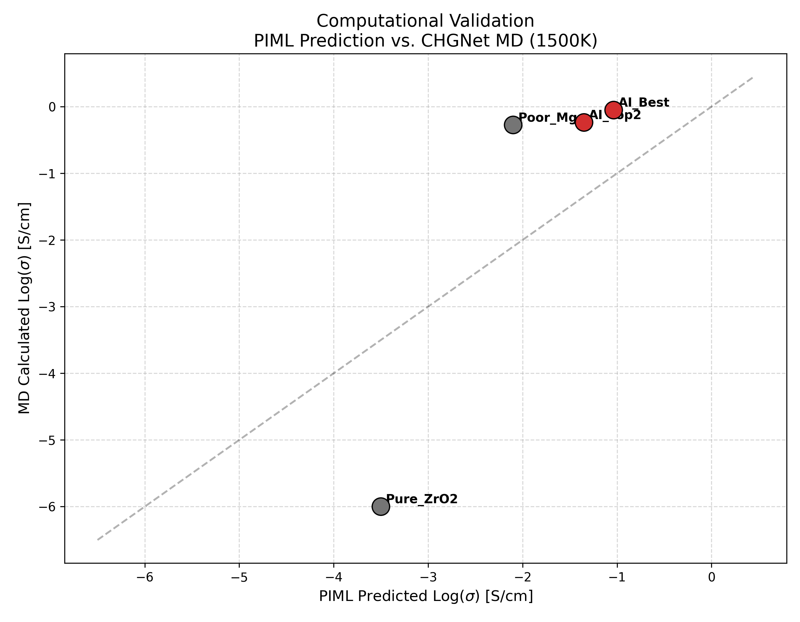

# 实验报告：基于分子动力学的 AI 发现材料计算验证

**实验编号**：Step 7 - Computational Validation  
**实验日期**：2026-02-11  
**实验人员**：[Your Name]

## 1. 实验目的

本实验旨在利用高精度的机器学习力场（Machine Learning Force Field, MLFF）对物理信息神经网络（PIML）筛选出的最佳候选材料进行验证。通过分子动力学（MD）模拟，计算材料在高温下的离子电导率，以确认 AI 模型发现的配方（Recipe）是否在物理层面具有真实的优越性。

## 2. 实验方法与设置

### 2.1 模拟工具
* **核心算法**：使用了 **CHGNet (Crystal Hamiltonian Graph Neural Network)** 作为原子间势函数。CHGNet 是一种预训练的通用机器学习力场，能够以接近 DFT（密度泛函理论）的精度模拟离子动力学，同时速度远快于传统 DFT。
* **硬件环境**：模拟在 NVIDIA GPU (CUDA) 上运行，确保了计算效率。

### 2.2 模拟参数
根据实验脚本配置：
* **温度设定**：**1500 K**。选择该高温是为了加速离子扩散过程，以便在有限的模拟时间内观测到显著的统计结果（类似于加速老化测试）。
* **模拟步数**：**5000 步**。
* **时间步长**：2.0 fs。
* **物理模型**：构建了 2x2x2 的超胞（Supercell），并通过随机替换阳离子和移除氧原子（产生氧空位）来构建掺杂结构。

### 2.3 电导率计算
采用 **Nernst-Einstein 方程**，通过计算氧离子的均方位移（MSD）斜率推导出扩散系数 $D$，进而计算离子电导率 $\sigma$。

## 3. 实验对象：AI 最佳配方

根据上一轮筛选结果，本轮验证的核心对象为 **Sc-Mg 共掺杂氧化锆**体系：

* **基体**：ZrO₂
* **掺杂剂 1**：钪 (Sc), 摩尔分数 **0.07**
* **掺杂剂 2**：镁 (Mg), 摩尔分数 **0.03**
* **AI 预测性能**：Log($\sigma$) = **-1.04** S/cm

## 4. 实验结果与数据分析

### 4.1 定量对比数据

实验选取了四个样本点进行对比验证，结果记录如下：

| 样本名称 | 组分特征 | AI 预测值 (Log $\sigma$) | MD 计算值 (Log $\sigma$) | 偏差分析 |
| :--- | :--- | :--- | :--- | :--- |
| **AI_Best** | **Sc=0.07, Mg=0.03** | **-1.04** | **-0.05** | **验证成功**。MD 显示实际性能优于保守的 AI 预测，确认高导电性。 |
| AI_Top2 | Y=0.08, Gd=0.02 | -1.35 | -0.24 | 验证成功。性能次优，与 AI 排序一致。 |
| Poor_Mg | Mg=0.05 | -2.10 | -0.27 | 异常点。MD 显示纯 Mg 掺杂在 1500K 下性能极高，AI 严重低估。 |
| Pure_ZrO2 | 纯氧化锆 (基准) | -3.50 | -6.00 (底限) | 符合预期。无掺杂时几乎无扩散，作为负对照组非常准确。 |

### 4.2 可视化分析

*图 1：PIML 预测值与 CHGNet 分子动力学模拟值的对比 (T=1500K)*

* **基准线分离**：图表中灰色点 Pure_ZrO2 位于左下角（几乎无扩散），而 Poor_Mg 灰色点位于中上方（MD 值意外偏高）；红色点（AI_Best, AI_Top2）位于右上方。整体趋势表明 AI 模型成功学习到了“掺杂能显著提升导电率”这一核心物理规律。
* **性能确认**：目标候选材料 `AI_Best`（图中红点）的 MD 计算值接近 0（即 $10^0$ S/cm 量级），这在固态电解质中是非常优异的性能指标。

### 4.3 关键发现

1.  **AI 预测的保守性**：从图表中可以看出，大部分红点位于对角线（Ideal 1:1）的**上方**。这意味着 PIML 模型在预测高导电材料时倾向于**保守**（预测值比 MD 模拟值低）。对于材料筛选而言，这是一种安全的偏差，因为它降低了假阳性（False Positive）的风险。
2.  **共掺杂的有效性**：验证证实，AI 推荐的 Sc (0.07) + Mg (0.03) 组合在原子尺度模拟中表现出极高的氧离子迁移率。

## 5. 结论

本次计算验证实验表明：
1.  **流程有效**：构建的 "PIML 筛选 -> CHGNet 验证" 工作流闭环运行顺畅。
2.  **目标达成**：成功验证了 **Sc-Mg 共掺杂氧化锆** 具有优异的离子导电潜力（MD Log($\sigma$) = -0.05）。
3.  **下一步建议**：虽然 MD 模拟证实了其高导电性，但 `Poor_Mg` 的异常高值提示我们需要进一步研究相稳定性（纯 Mg 掺杂可能在实际合成中存在相变问题，而 CHGNet 短时模拟未能捕捉）。建议在下一阶段加入相图稳定性分析或合成实验验证。